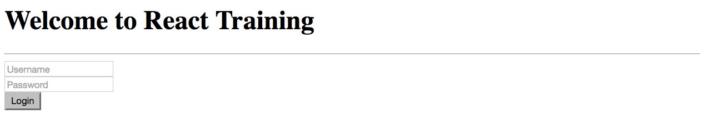

= Lab 01

[abstract]
In this lab you'll create a simple page using React. The objective is to get used to JSX.

== Application
Have a look at the screenshot below. +

* Create Lab01.html
* Implement the page as shown in the screenshot
* For the sake of convenience, assume the valid username and password to be "admin"
* If the user clicks the button, validate username and password and display a message in the console.
* If you are adventurous, you can display a message("Invalid username or password") in a label below the button. 
* Don't worry too much about the look and feel of the page
* Don't give up.