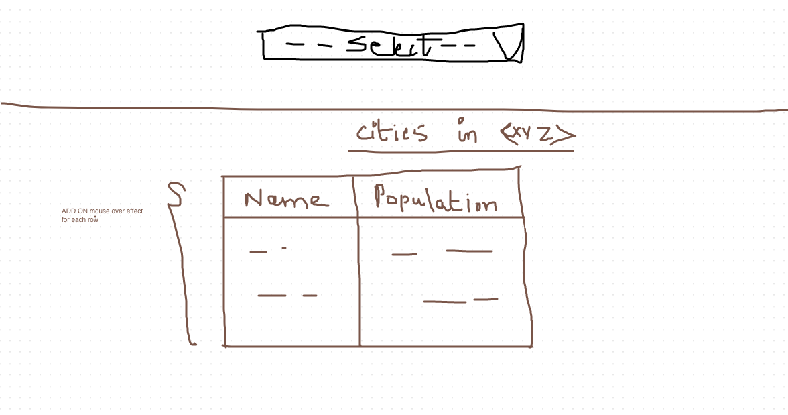

= Lab 02

[abstract]
In this lab you'll continue to work with React states

== Application
Have a look at the screenshot below. +

* Create Lab02.html
* Create a dropdown list dynamically populated with the following states: India, USA, UK
* When you select a country, the cities in that country will be displayed in a table below.
* You can use the following information
====
India -> (Chennai, Bangalore, Pune)
USA -> (Houston, NewYork, Dallas)
UK -> (London, Bristol, Manchester)
====
* Generate a random number as population for each city
* Cities with population more than 10 Lakhs should be highlighted in "red"
* Cities with population less than 1 lakh should be highlighed in "yellow"

* Given below is a screenshot
* 
